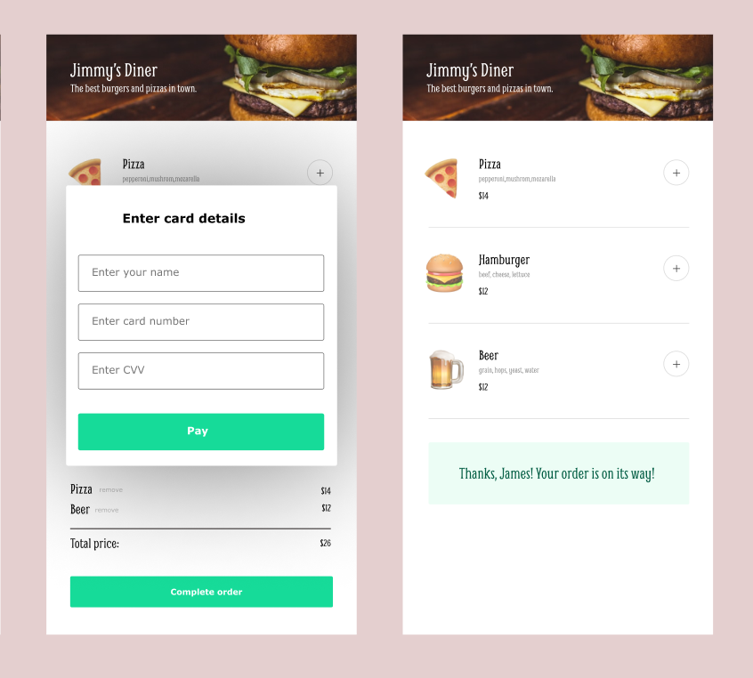

## Huey's Diner Project

Live demo => https://hueys-diner.netlify.app/

Project is mini ordering app which users can add listed items to the bag and order selected items.  

### What I have done?

In this project, I have used some JavaScript concepts such as .forEach() method, data attributes to store some information inside of an element, conditionally rendering by checking a boolean, NOT operator. 

### The asked design

